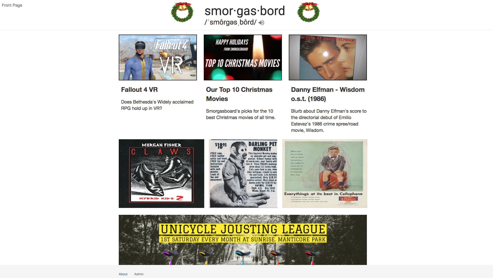

## smorgasboard
by

#### James Osborn
jamescarlosborn@gmail.com

#### Mark Woodward
markwood117@gmail.com

#### Joseph Tomlinson
bizzclaw1@gmail.com

#### Elliot Burin
eburin2@gmail.com

## Description

smorgasbaord is a variety news outlet for today's discerning tech and entertainment fan. Unlike other news sites that inundate the reader with only boring news stories, smorgasboard has a variety of content such as food and drink recipes and album and movie reviews. This is a once a year publication, for the holiday 2017 season.

This project was generated with [Angular CLI](https://github.com/angular/angular-cli) version 1.0.0.

## Screenshot



## Technologies Used

- Angular 2
- node package manager
- bower
- Chrome
- Firebase key

## Installation

To install all packages to be able to run the website, you must:

```
Go to Firebase, make an account  
Go to Get Started  
Go to Add a project  
Go to Add Firebase to your web app  
Copy everything within the brackets  
Open a command prompt  
Navigate to the project directory  
Open project in your favorite text editor (Atom recommended)  
In the src/app folder, create a new file called api-keys.ts  
Enter "export const masterFirebaseConfig = {}"  
Copy everything you got from Firebase to within the brackets  
Save the file  
Enter "npm install"  
Enter "bower install"  
Enter "ng serve"  
Open your favorite web browser (Chrome recommended)  
In the address bar, go to "localhost:4200"
Enjoy
```


## Known Bugs

* Dates will not be displayed in the article list or article detail.
* Images that are too wide will show extra white space on the bottom.
* Formatting doesn't hold up when shrinking the browser width.
* Submitting a new article doesn't clear the entry fields.
* Can't add new articles.  

## Support and contact details

You can contact the developers if you have any problems with this program please contact jamescarlosborn@gmail.com

## User Stories

User Story: As a viewer, I want to see a site header, top 3 articles, and list of all articles than I can filter by date or tags, and click on to see the full article.  

User Story: As a viewer, I want to be able to read an article, see all of its images and contents.  

User Story: As an employee, I want to be able to post a new blog entry with a title, author, body, images, thumbnail, and tags field.  

User Story: As an employee, I'd like to be able to edit or delete posts.  

User Story: As an employee, I want to be able to tag an article to be a featured article to be displayed in the featured articles section on the main page.  

## Specs

Description: Articles' headline and first paragraph to the full article are displayed in a list on the front page.  
Input: 3 articles  
Output: Articles are displayed vertically, with information like "Killer Bees on the loose!" "Killer Bees are taking America by swarm. Better board up your windows."  

Description: Click on an article's header will view all of its content.  
Input: Click "Killer Bees on the loose!"  
Output: See title, author, body, images, thumbnail, and tags field.  

Description: Able to post an article on the admin panel.  
Input: Click "Admin"  
Output: User is able to add a new article  

Description: Able to add an article thumbnail image on the admin panel.  
Input: add thumbnail URL  
Output: Thumbnail appears as image on "featured articles"  

Description: Able to add an article's main images on the admin panel.  
Input: add images  
Output: Images appear throughout the article's content  

Description: Able to add tags to a new article.  
Input: Add "Video Games" or "Film"  
Output: Tags return "Video Games" or "Film"  

Description: Able to add "featured article" as a tag to a new article.  
Input: Click "Featured Article" toggle when creating a new article  
Output: Article appears as a featured article  

Description: Able to edit an article on the admin panel.  
Input: Click "Admin"  
Output: User is able to edit an article  

Description: Able to delete an article on the admin panel.  
Input: Click "Admin"  
Output: User is able to delete an article  

Description: Main article list can be filtered by tags.  
Input: Filter for "Video Games"  
Output: All "Video Games" articles are displayed  

Description: Speaker button appears next to title in header, clicking it plays the Wilhelm scream.  
Input: Click speaker button  
Output: "AhhhhhhhHHHhhHhhHHH!"  

Description: Footer contains a back to top button  
Input: Click "back to top" goes to the top of the page  
Output: goes to the top of the page  

Description: Footer contains copyright info  
Input: View page  
Output: Copyright info appears at the bottom  

Description: Footer contains "Home" button  
Input: Click "Home"  
Output: goes back to front page  

Description: Footer contains "About" button  
Input: Click "About"  
Output: goes to page with all of collaborator's git hubs  
